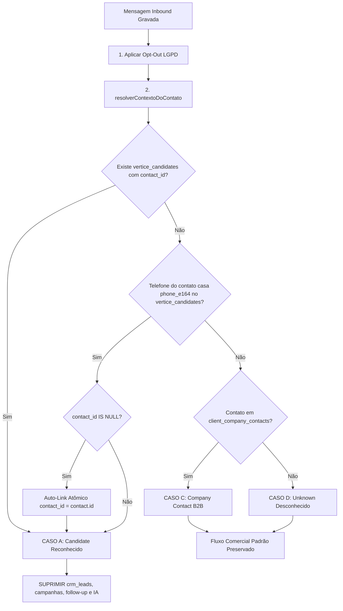

# Roteamento Semântico de WhatsApp — Candidate ≠ CRM Lead (Fase 4.4A)

> **Status:** Implementado & Testado (Fase 4.4A)  
> **Data:** 2026-09-16  
> **Branch:** `feat/whatsapp-candidate-routing-4.4a`  
> **Base:** `main` (`ec2d1086784703d627d25a557510e64128fdfc82`)  

---

## 1. O Problema Resolvido

Na arquitetura herdada de CRM genérico (Deskcomm), o pipeline de pós-entrada de mensagens (`lib/channels/pos-entrada.ts`) tratava toda mensagem inbound como oportunidade comercial de vendas:

$$\text{Inbound WhatsApp} \longrightarrow \text{abrirDemanda()} \longrightarrow \text{garantirLeadDaConversa()} \longrightarrow \text{crm\_leads}$$

Para a **Vértice Pessoas & Estratégia**, esse comportamento gerava contaminação crítica de dados:
1. Candidatos a vagas de emprego que enviavam mensagem no WhatsApp oficial viravam cards de venda no funil comercial B2B.
2. Robôs de IA de vendas (`ai_agent.dispatch_requested`) e cadências de follow-up eram acordados para tentar "vender" para quem estava se candidatando.
3. Recrutadores perdiam o rastro de talentos no módulo People/Recrutamento, enquanto o CRM de vendas ficava inflado com dados sem valor comercial.

---

## 2. A Regra Inviolável do Produto

```
================================================================
CANDIDATO / TALENTO   =   RECRUTAMENTO & SELEÇÃO (R&S)
EMPRESA / DECISOR     =   CRM COMERCIAL (B2B)

            CANDIDATO NUNCA DEVE VIRAR CRM LEAD.
================================================================
```

---

## 3. Algoritmo de Roteamento Semântico

O serviço de domínio [`lib/channels/candidate-routing.ts`](../../lib/channels/candidate-routing.ts) expõe a função `resolverContextoDoContato(admin, { organizationId, contactId })`, executada durante o pós-entrada:



### 3.1 CASO A — Reconhecimento por Vínculo Direto
Se existir registro em `vertice_candidates` com `organization_id = :org_id` e `contact_id = :contact_id`, o contato é imediatamente classificado como `candidate`.

### 3.2 CASO B — Reconhecimento por Telefone & Auto-Link Seguro
Se não houver vínculo direto, o telefone do contato é obtido da tabela `contacts` (`phone_number`) e expandido para suas variantes canônicas brasileiras via `phoneLookupVariants` (tratamento formal do 9º dígito).
- Se exatamente 1 candidato da mesma organização casar com as variantes:
  - Se `candidate.contact_id` for `NULL`: executa **update atômico e condicional** (`UPDATE vertice_candidates SET contact_id = :contact_id WHERE organization_id = :org_id AND id = :cand_id AND contact_id IS NULL`).
  - Se já estiver vinculado a outro contato: preserva o vínculo prévio sem sobrescrever e classifica como `candidate`.
- Se múltiplos candidatos casarem (anomalia de base): loga aviso e aciona o **fail-safe**: classifica como `candidate` para prevenir contaminação no CRM comercial.

### 3.3 CASO C — Contato de Empresa (B2B)
Se o contato estiver associado à tabela `client_company_contacts` da mesma organização, é classificado como `company_contact`. O fluxo de CRM existente é 100% preservado.

### 3.4 CASO D — Contato Desconhecido (Unknown)
Se nenhuma regra casar, é classificado como `unknown`. O comportamento atual de criação de lead comercial é preservado, mantendo em aberto a futura decisão humana sobre triagem automática de novos entrantes.

---

## 4. Matriz de Efeitos Pós-Entrada

| Efeito | Candidate | Company Contact | Unknown Contact |
| :--- | :---: | :---: | :---: |
| **Gravação da Mensagem na Inbox** | ✅ Sim | ✅ Sim | ✅ Sim |
| **Gravação da Conversa na Inbox** | ✅ Sim | ✅ Sim | ✅ Sim |
| **Opt-Out Incondicional (LGPD)** | ✅ Sim | ✅ Sim | ✅ Sim |
| **Auto-Link com Candidato** | ✅ Sim | ❌ N/A | ❌ N/A |
| **Criação de Card no CRM (`crm_leads`)** | 🛑 **SUPRIMIDO** | ✅ Sim | ✅ Sim |
| **Avaliação de Campanhas de Anúncios** | 🛑 **SUPRIMIDO** | ✅ Sim | ✅ Sim |
| **Aceleração de Cadência (Follow-up)** | 🛑 **SUPRIMIDO** | ✅ Sim | ✅ Sim |
| **Despacho de Agente de IA Comercial** | 🛑 **SUPRIMIDO** | ✅ Sim | ✅ Sim |

---

## 5. Garantias de Segurança, Tenant Isolation & Concorrência

1. **Multi-tenant Obrigatório:** Todas as consultas e mutações em `vertice_candidates`, `contacts` e `client_company_contacts` contêm cláusula estrita `.eq("organization_id", organizationId)`. É impossível vincular um candidato de uma organização ao contato de outra.
2. **Race-Safety & Idempotência:** O auto-link utiliza cláusula `.is("contact_id", null)` na atualização. Se duas requisições de webhook chegarem em paralelo, apenas uma realiza o update e a outra lê o estado final de forma consistente.
3. **Privacidade e Logs (LGPD):** Nenhum log inclui telefones, nomes completos ou texto de mensagens. São emitidos apenas identificadores técnicos opacos (`organization_id`, `contact_id`, `candidate_id`, `conversation_id`).
4. **Sem Migrations:** A tabela `vertice_candidates` já possui os índices únicos parciais `(organization_id, phone_e164)` e `(organization_id, contact_id)` e a trigger `trg_candidate_contact_same_org` herdados da People Foundation 4.2.2. Zero alterações de schema foram necessárias.

---

## 6. Cobertura de Testes Automatizados

A suíte [`tests/unit/pos-entrada-candidate-routing.test.ts`](../../tests/unit/pos-entrada-candidate-routing.test.ts) valida os 8 cenários mandatários:

1. `TESTE 1`: Candidate já vinculado a `contact_id` $\rightarrow$ inbound $\rightarrow$ NÃO cria `crm_lead`.
2. `TESTE 2`: Candidate com mesmo `phone_e164` e `contact_id` NULL $\rightarrow$ inbound $\rightarrow$ auto-link executado $\rightarrow$ NÃO cria `crm_lead`.
3. `TESTE 3`: Segunda mensagem do mesmo Candidate $\rightarrow$ idempotente $\rightarrow$ nenhum lead criado e vínculo mantido.
4. `TESTE 4`: Mesmo número em OUTRA organization $\rightarrow$ não vincula cross-tenant $\rightarrow$ candidato externo permanece intocado.
5. `TESTE 5`: Contato desconhecido $\rightarrow$ comportamento atual preservado $\rightarrow$ lead comercial criado.
6. `TESTE 6`: `client_company_contact` conhecido $\rightarrow$ comportamento comercial preservado.
7. `TESTE 7`: Candidate envia opt-out ("PARAR") $\rightarrow$ contato bloqueado com auditoria $\rightarrow$ nenhum lead comercial.
8. `TESTE 8`: Concorrência/reentrega de socket diferente $\rightarrow$ não duplica vínculo nem sobrescreve contato prévio.

---

## 7. Próximos Passos (Fase 4.4B)

1. Homologação com Pareamento Real de WhatsApp (WAHA) após autorização e presença humana.
2. Implementação do painel lateral de candidato (`CandidateSidePanel`) na Inbox do Vértice Hub para visualização do currículo e candidatura do talento em tempo real.
