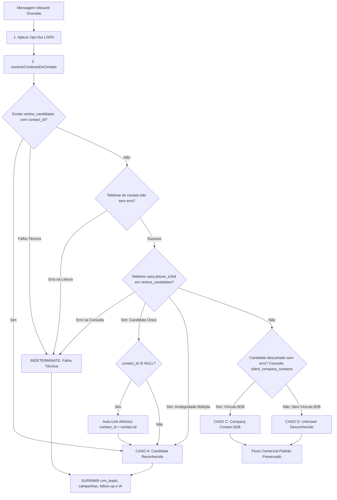

# Roteamento Semântico de WhatsApp — Candidate ≠ CRM Lead (Fase 4.4A)

> **Status:** Implementado & Testado com Classificação Fail-Closed (Fase 4.4A)
> **Data:** 2026-09-17
> **Branch:** `feat/whatsapp-candidate-routing-4.4a`
> **Base:** `main` (`ec2d1086784703d627d25a557510e64128fdfc82`)  

---

## 1. O Problema Resolvido

Na arquitetura herdada de CRM genérico (Deskcomm), o pipeline de pós-entrada de mensagens (`lib/channels/pos-entrada.ts`) tratava toda mensagem inbound como oportunidade comercial de vendas:

$$\text{Inbound WhatsApp} \longrightarrow \text{abrirDemanda()} \longrightarrow \text{garantirLeadDaConversa()} \longrightarrow \text{crm\_leads}$$

Para a **Vértice Pessoas & Estratégia**, esse comportamento gerava contaminação crítica de dados:
1. Candidatos a vagas de emprego que enviavam mensagem no WhatsApp oficial viravam cards de venda no funil comercial B2B.
2. Robôs de IA de vendas (`ai_agent.dispatch_requested`) e cadências de follow-up eram acordados para tentar "vender" para quem estava se candidatando.
3. Recrutadores perdiam o rastro de talentos no módulo People/Recrutamento, enquanto o CRM de vendas ficava inflado com dados sem valor comercial.

---

## 2. A Regra Inviolável do Produto

```
================================================================
CANDIDATO / TALENTO   =   RECRUTAMENTO & SELEÇÃO (R&S)
EMPRESA / DECISOR     =   CRM COMERCIAL (B2B)

            CANDIDATO NUNCA DEVE VIRAR CRM LEAD.
================================================================
```

---

## 3. Princípio Fail-Closed e Semântica de Estados

A classificação no pós-entrada segue estritamente o **Princípio Fail-Closed para efeitos comerciais**:
- A mensagem e conversa **JÁ estão persistidas** na Inbox quando a classificação roda.
- Uma falha de classificação **NÃO gera erro 500** nem derruba a ingestão.
- Se ocorrer qualquer falha técnica que impeça provar com certeza a ausência de Candidate, o sistema adota o estado `indeterminate` e **SUPRIME TODOS OS EFEITOS COMERCIAIS**.

### 3.1 Definição Rigorosa dos Estados

| Estado | Significado Semântico | Comportamento Comercial |
| :--- | :--- | :--- |
| **`candidate`** | Há evidência positiva de Candidate (por `contact_id` ou `phone_e164`). | 🛑 **Suprimido** (sem card no funil, sem IA de vendas, sem follow-up). |
| **`company_contact`** | Candidate foi **descartado com sucesso sem erro técnico** e há vínculo B2B (`client_company_contacts`). | ✅ **Ativo** (fluxo comercial de empresa preservado). |
| **`unknown`** | Candidate foi **descartado com sucesso sem erro técnico** e não há vínculo B2B. | ✅ **Ativo** (fluxo comercial padrão mantido). |
| **`indeterminate`** | Houve **falha técnica** (erro no banco, timeout ou exceção) que impediu descartar Candidate com segurança. | 🛑 **Suprimido (Fail-Closed)**. Nenhum lead comercial criado. Atendimento humano na Inbox. |

> [!IMPORTANT]
> **Diferença Crítica entre `UNKNOWN` e `INDETERMINATE`:**
> - **`UNKNOWN`** significa: *"Conseguimos executar todas as verificações de Candidate sem erro e confirmamos que este contato NÃO é um candidato."*
> - **`INDETERMINATE`** significa: *"Ocorreu um erro técnico na leitura do banco e NÃO temos certeza se ele é ou não um candidato."*
> **`INDETERMINATE` NUNCA dispara automações comerciais.**

---

## 4. Algoritmo de Roteamento Semântico

O serviço [`lib/channels/candidate-routing.ts`](../../lib/channels/candidate-routing.ts) expõe a função `resolverContextoDoContato(admin, { organizationId, contactId })`, executada durante o pós-entrada:



---

## 5. Matriz de Efeitos Pós-Entrada

| Efeito | Candidate | Indeterminate (Fail-Closed) | Company Contact | Unknown Contact |
| :--- | :---: | :---: | :---: | :---: |
| **Gravação da Mensagem na Inbox** | ✅ Sim | ✅ Sim | ✅ Sim | ✅ Sim |
| **Gravação da Conversa na Inbox** | ✅ Sim | ✅ Sim | ✅ Sim | ✅ Sim |
| **Opt-Out Incondicional (LGPD)** | ✅ Sim | ✅ Sim | ✅ Sim | ✅ Sim |
| **Auto-Link com Candidato** | ✅ Sim | ❌ N/A | ❌ N/A | ❌ N/A |
| **Criação de Card no CRM (`crm_leads`)** | 🛑 **SUPRIMIDO** | 🛑 **SUPRIMIDO** | ✅ Sim | ✅ Sim |
| **Avaliação de Campanhas de Anúncios** | 🛑 **SUPRIMIDO** | 🛑 **SUPRIMIDO** | ✅ Sim | ✅ Sim |
| **Aceleração de Cadência (Follow-up)** | 🛑 **SUPRIMIDO** | 🛑 **SUPRIMIDO** | ✅ Sim | ✅ Sim |
| **Despacho de Agente de IA Comercial** | 🛑 **SUPRIMIDO** | 🛑 **SUPRIMIDO** | ✅ Sim | ✅ Sim |

---

## 6. Garantias de Segurança, Tenant Isolation & Concorrência

1. **Multi-tenant Obrigatório:** Todas as consultas e mutações em `vertice_candidates`, `contacts` e `client_company_contacts` contêm cláusula estrita `.eq("organization_id", organizationId)`. É impossível vincular um candidato de uma organização ao contato de outra.
2. **Race-Safety & Idempotência:** O auto-link utiliza cláusula `.is("contact_id", null)` na atualização. Se duas requisições de webhook chegarem em paralelo, apenas uma realiza o update e a outra lê o estado final de forma consistente sem sobrescrever `contact_id` prévio.
3. **Privacidade e Logs (LGPD):** Nenhum log inclui telefones, nomes completos ou texto de mensagens. São emitidos apenas identificadores técnicos opacos (`organization_id`, `contact_id`, `candidate_id`, `conversation_id`, `motivo`).
4. **Sem Migrations:** A tabela `vertice_candidates` já possui os índices únicos parciais `(organization_id, phone_e164)` e `(organization_id, contact_id)` e a trigger `trg_candidate_contact_same_org` herdados da People Foundation 4.2.2. Zero alterações de schema foram necessárias.

---

## 7. Cobertura de Testes Automatizados (14 Cenários)

A suíte [`tests/unit/pos-entrada-candidate-routing.test.ts`](../../tests/unit/pos-entrada-candidate-routing.test.ts) valida os 14 cenários mandatórios:

1. `TESTE 1`: Candidate já vinculado a `contact_id` $\rightarrow$ inbound $\rightarrow$ NÃO cria `crm_lead`.
2. `TESTE 2`: Candidate com mesmo `phone_e164` e `contact_id` NULL $\rightarrow$ inbound $\rightarrow$ auto-link executado $\rightarrow$ NÃO cria `crm_lead`.
3. `TESTE 3`: Segunda mensagem do mesmo Candidate $\rightarrow$ idempotente $\rightarrow$ nenhum lead criado e vínculo mantido.
4. `TESTE 4`: Mesmo número em OUTRA organization $\rightarrow$ não vincula cross-tenant $\rightarrow$ candidato externo permanece intocado.
5. `TESTE 5`: Contato desconhecido $\rightarrow$ comportamento atual preservado $\rightarrow$ lead comercial criado.
6. `TESTE 6`: `client_company_contact` conhecido $\rightarrow$ comportamento comercial preservado.
7. `TESTE 7`: Candidate envia opt-out ("PARAR") $\rightarrow$ contato bloqueado com auditoria $\rightarrow$ nenhum lead comercial.
8. `TESTE 8`: Concorrência/reentrega de socket diferente $\rightarrow$ não duplica vínculo nem sobrescreve contato prévio.
9. `TESTE 9`: Consulta Candidate por `contact_id` retorna erro $\rightarrow$ contexto `indeterminate` $\rightarrow$ nenhum efeito comercial disparado.
10. `TESTE 10`: Leitura de `contacts.phone_number` falha $\rightarrow$ contexto `indeterminate` $\rightarrow$ nenhum efeito comercial disparado.
11. `TESTE 11`: Consulta `vertice_candidates` por `phone_e164` falha $\rightarrow$ contexto `indeterminate` $\rightarrow$ nenhum efeito comercial disparado.
12. `TESTE 12`: Exceção inesperada geral no resolver $\rightarrow$ contexto `indeterminate` $\rightarrow$ nenhum efeito comercial disparado e zero erro 500 no webhook.
13. `TESTE 13`: Candidate encontrado por `contact_id` com falhas em lookups subsequentes $\rightarrow$ evidência positiva prevalece $\rightarrow$ `candidate` sem efeitos comerciais.
14. `TESTE 14`: Classificação concluída com sucesso sem erros e sem Candidate $\rightarrow$ `unknown` $\rightarrow$ fluxo comercial ativado normalmente.

---

## 8. Próximos Passos (Fase 4.4B)

1. Homologação com Pareamento Real de WhatsApp (WAHA) após autorização e presença humana.
2. Implementação do painel lateral de candidato (`CandidateSidePanel`) na Inbox do Vértice Hub para visualização do currículo e candidatura do talento em tempo real.
